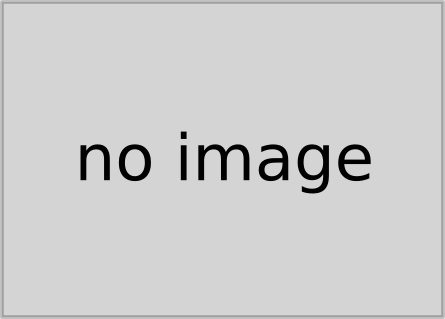

# Hello World

This is my home page! My name is Rowan, and I am a student at [Cal State Fullerton](http://www.fullerton.edu/). Im currently majoring in electrical engineering.

## Computer Science Projects

My GitHub page is [https://rowanyarnell-csuf.github.io/](https://rowanyarnell-csuf.github.io/).

### CPSC 120

* [Lab 12](https://csufullerton.instructure.com/courses/3555495/assignments/39391879)

    Most recently I completed Lab 12. This was super interesting as it deals with graphics and image creation/manipulation via math equations. I explored some of this previously with TouchDesigner, so its cool to try with C++ instead of nodes.

* [Lab 8](https://csufullerton.instructure.com/courses/3555495/assignments/39391888)

    Lab 8 was tricky but still interesting. The lab revolves around building a program that returns the average of multipule scores. It failed compiling for 20 minutes after class, and finally complied after removing quotation marks from a hedder. While the intent of the lab was to practice loops and using command line arguments, this lab instead taught me how precice syntax in C++ needs to be, especially after coming from Python.

* [Lab 9](https://csufullerton.instructure.com/courses/3555495/assignments/39391889)

    Lab 9 is only here because it was the best grade ive gotten on a lab and as an honorable mention to my lab partner who saved me after I got dragged away to ventura. This lab was centered around creating a spell checker, and . The intent was to learn about I/O and handling opening/closing files. It was also a syntaxically (made up word) difficult project for me. 

